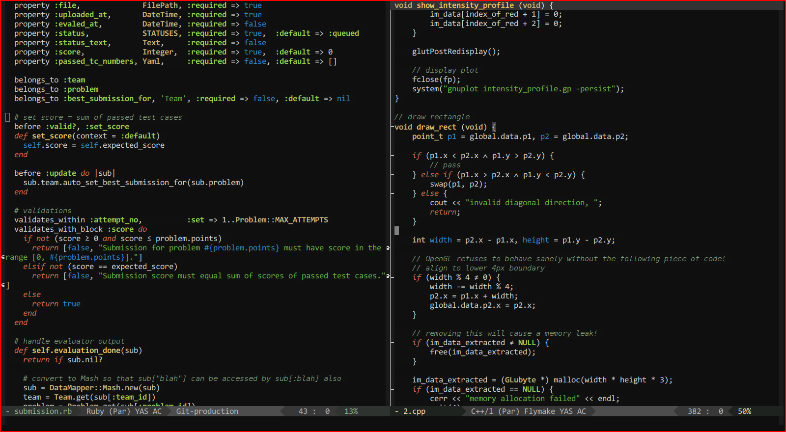

My Emacs config
===============

This directory contains my entire Emacs config. I've tried to keep it as modular
and hackable as possible. All the initialization files are in [init/](init), and
color themes are in [themes/](themes).

All that my top-level [.emacs](../.emacs) does is load the init files. The
various init files are listed below:

 - [interface-and-environment.el](init/interface-and-environment.el)
 - [utils.el](init/utils.el)
 - [plugins.el](init/plugins.el)
 - [major-modes.el](init/major-modes.el)
 - [keybindings.el](init/keybindings.el)
 - [experimental.el](init/experimental.el)

What these files do is explained in the first line of each file. Each of them is
generously commented, so that modifying them is a simple affair.

The theme I'm currently using is a modified version of Sunburst, and can be
found [here](themes/sunburst-theme.el). **NOTE**: It only works with Emacs 24+.

Screenshots
-----------

Here's a screenshot of my modified Sunburst theme:

